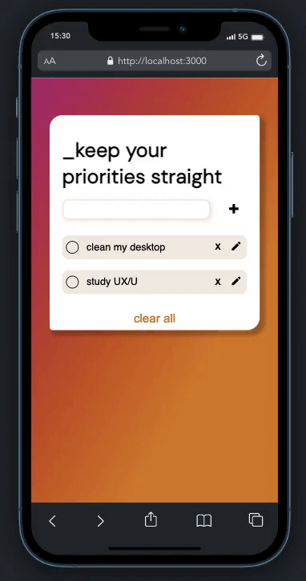
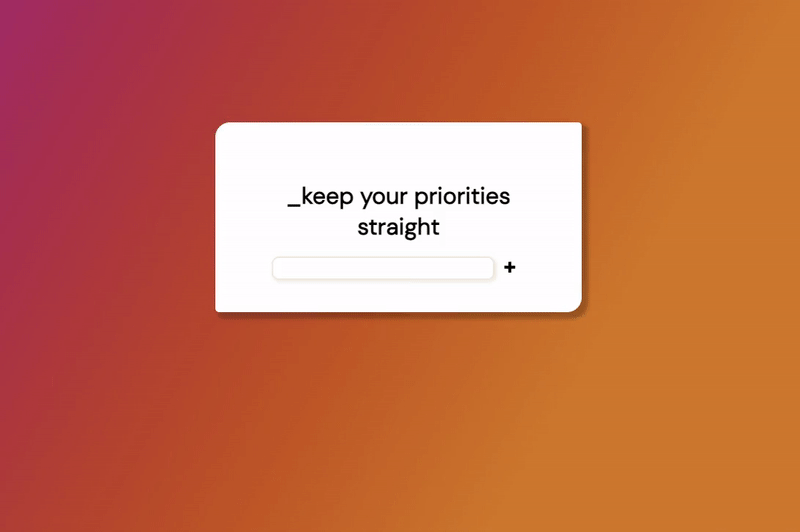

## To-do List w/ hooks

<i>Projeto desenvolvido como desafio referente ao módulo 2 do curso Vai na Web de desenvolvimento front-end. </i>  

    
    
    
    

 

Neste projeto construi uma pequena aplicação no estilo "todo list", agora utilizando `react function component` e `react hooks`. Além disso, foi desenvolvido a partir do paradigma "mobile first".

Para ver a aplicação homóloga em `class components` <a href="https://github.com/sophiacrds/TodoList-VNW">clique aqui</a>.

## PREVIEW

  
  

 

    

